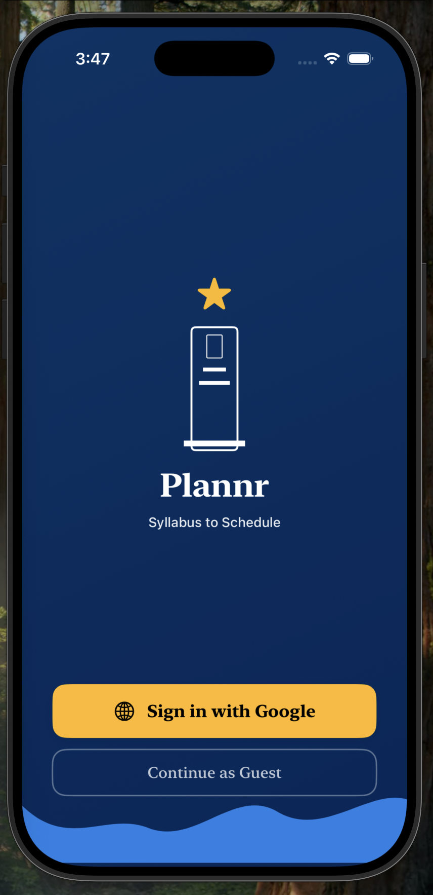
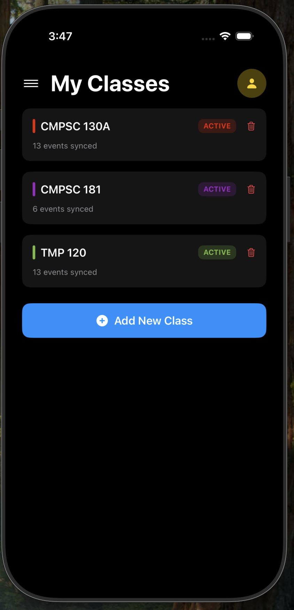
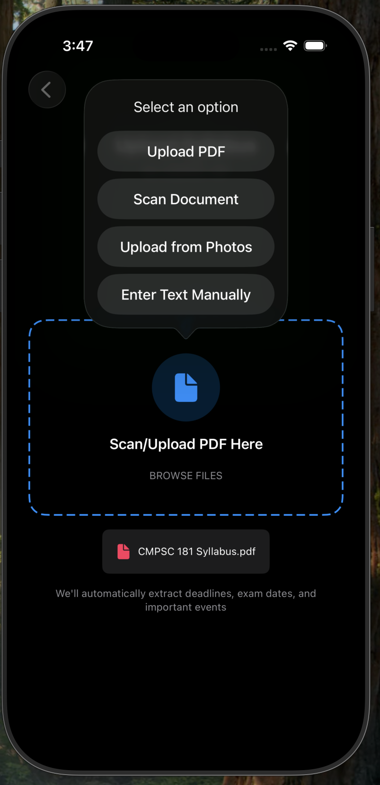
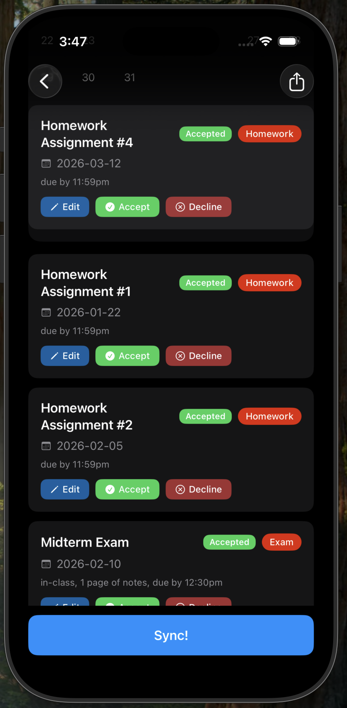
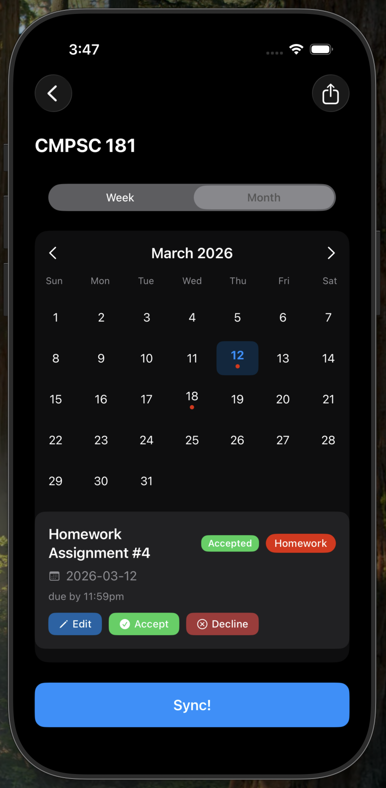
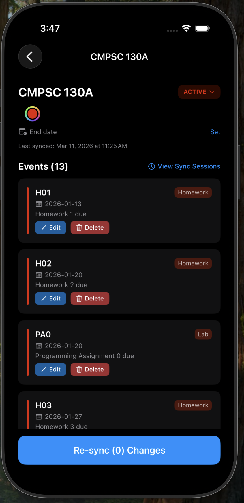
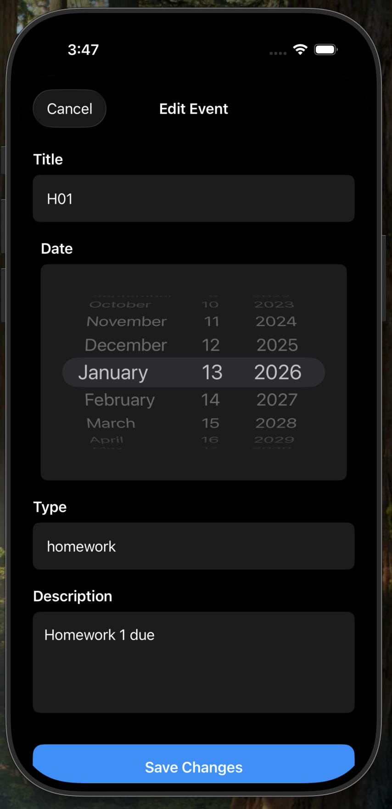
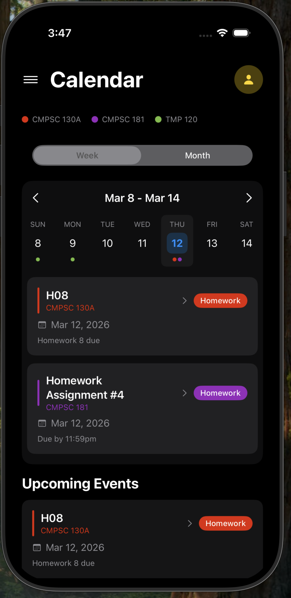
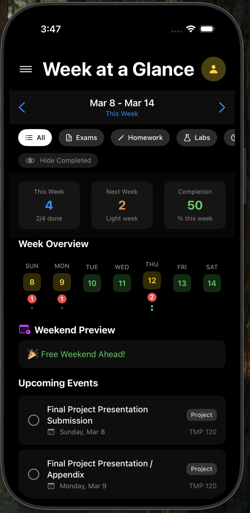
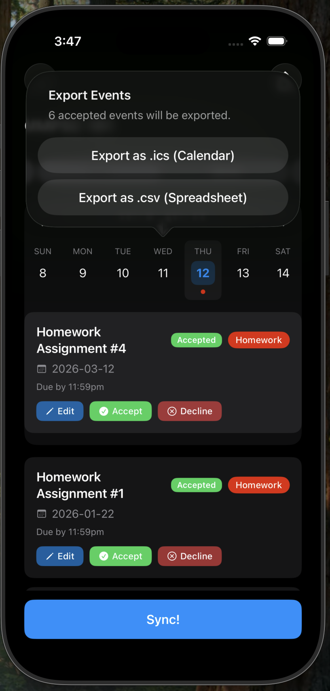

## **Description of Product Purpose**

Managing a course syllabus is one of the first challenges students face at the start of every semester/quarter. Each syllabus is packed with critical dates like assignment deadlines, exam schedules, quiz dates, and project milestones. Manually transferring all of that information into a calendar is time-consuming and prone to human error. A single missed entry can mean a missed deadline.

Plannr solves this problem by automatically parsing uploaded syllabi and converting all relevant dates and events into Google Calendar entries. Using text recognition and Google Gemini, Plannr identifies key academic events within a syllabus document and creates structured, color-coded calendar events. This means no copying, no manual entry, and no guesswork. Students simply upload their syllabus, and Plannr handles the rest, populating their Google Calendar with everything they need to stay on track throughout the semester/quarter.

## **Intended User Audience**

Plannr is designed for college and high school students who are managing the demands of multiple classes simultaneously. At any given time, a typical student may be juggling four to six courses, each with its own syllabus, grading timeline, and schedule of deadlines. Keeping track of it all manually is overwhelming and easy to get wrong.

Plannr is built for students who want to stay organized without spending hours setting up their calendar at the start of each term. Whether a student is trying to plan ahead for a heavy exam week, balance overlapping project deadlines, or simply avoid missing an assignment, Plannr gives them a clear, automated view of their academic schedule from day one. The app is especially valuable for students who are new to managing a heavy course load, though any student looking to focus more on their coursework will benefit.

## **Features**

### Sign In / Guest Mode

Users can sign in with their Google account to enable full calendar sync and persistent data storage. A Guest Mode is also available for users who want to try the app without signing in; classes and events created in guest mode are not saved between sessions, and Google Calendar sync is unavailable. Guests can still parse syllabi, review events, and export them as `.ics` or `.csv`.

If Google access is later revoked (for example, by removing the app from your Google Account settings), Plannr detects this on next launch, signs you out, and prompts you to sign in again.

### Add Classes

Users can add multiple classes and view their full class list on the home page. Each class can be assigned a custom color for easy visual identification across the calendar.

When adding or editing a class, users can set a **structured weekly schedule** — pick the lecture days and a start/end time, and optionally a separate section/lab meeting on its own day and time. The schedule can also carry a first-meeting date, a "repeat for X weeks" limit, and a final-exam date and time. Uploading a syllabus that states these times fills them in automatically (see AI-Powered Event Extraction).

Each class has a status shown as a tappable badge on its edit screen: **ACTIVE**, **INACTIVE**, or **NO SYLLABUS** (read-only, until events are added). Switching a class to **INACTIVE** — manually, or automatically once its end date passes — turns off its class-meeting sync, removes its recurring meeting events from Google Calendar, and unchecks (hides) its dedicated calendar in the Google Calendar sidebar without deleting it. Switching back to **ACTIVE** re-checks that calendar.

### Upload Syllabi

Users can upload their syllabi in four ways: PDF file upload, camera document scanning, photo library import, or manual text paste. Scanned pages and photos are run through OCR (text recognition) automatically. All methods convert the input into a format ready for AI processing.

Notes:
- Uploads are limited to 10 MB. OCR reads at most the first 30 pages of a scanned document.
- Camera scanning requires a physical device (it is not available on the iOS Simulator) and camera permission.
- For scanned or photographed syllabi, clear, high-contrast, straight-on images produce the best results.

### AI-Powered Event Extraction

Once a syllabus is uploaded, Plannr uses Google Gemini to intelligently parse the document and extract key academic dates. Events are automatically classified by type (homework, exam, quiz, lab, or other) and resolved to specific calendar dates, including relative references like "Week 3 Friday" or "Finals Week."

If the syllabus explicitly states the class's meeting times — e.g. "Lecture: MWF 10:00–10:50am", "Discussion Thursdays 3:00pm", "Final Exam: Dec 12, 4:00–7:00pm" — Plannr also fills in the class's structured schedule (lecture days/time, section/lab days/time, final-exam date/time) so you don't have to type it. It only does this when the times are spelled out, and it never overwrites a schedule you set yourself.

### Preview Calendar

Before syncing, users can review all extracted events in a calendar preview, and accept or decline each one. Events can be edited (title, date, type, description) or removed before they are added to Google Calendar. Synced events are created as all-day entries. If the class has a schedule and the "Show in Calendar" setting is on, the preview grid also shows the recurring class meetings and final exam for context — these are display-only and aren't part of accept/decline or Sync.

### Edit Calendar Events
Users can edit any event after it has been parsed or synced. Changes made locally are preserved when re-uploading an updated syllabus, thanks to automatic event reconciliation.

### Calendar View

Plannr provides a weekly/monthly grid calendar showing all events from every class, color-coded by class for quick identification. Events can be filtered by type (homework, exam, quiz, lab, or all).

The list below the grid is scoped to whichever week or month the grid is currently showing (not every future event), and — when the setting is on (see Profile & Settings) — recurring class meetings and final exams appear in a separate "Class Meetings" group beneath the assignments.

### Week at a Glance

The Week at a Glance view gives users a focused look at their upcoming week, surfacing all deadlines and events across classes in a single compact view. This makes it easy to anticipate heavy workload periods and plan accordingly. When the "Show in Week at a Glance" setting is on, recurring class meetings for the week appear in a separate group under the "All" filter.

### Sync to Google Calendar

Users can push all parsed events to their Google Calendar with one tap. Plannr creates a dedicated secondary calendar for each class with a matching color. Re-syncing handles updates and deletions automatically.

### Class Meeting Sync

On a class with a structured schedule, signed-in users can turn on **Add class meetings to Google Calendar**. Plannr writes the weekly lecture and section times to that class's calendar as recurring events, plus a one-off event for the final exam. The recurrence runs until the "repeat for X weeks" limit, the class end date, or the term end date — whichever applies — and is open-ended if none is set. Turning the toggle off (or setting the class to INACTIVE) removes those recurring events again. Class meetings are kept out of the in-app Calendar and Week at a Glance views unless the corresponding display setting is enabled.

### Export Events

Events can be exported as an iCal (.ics) file compatible with most calendar apps, or as a CSV spreadsheet for use in other tools. Export is available to signed-in users and guests alike.

### Profile & Settings

The profile screen (tap the avatar in the top-right of the home screen) collects account and preference options in one place:

- **Profile photo** — use your Google account photo, or pick a custom one from your photo library.
- **Current Term** — pick **Quarter** (10 weeks), **Semester** (16 weeks), or **Custom**, and set a start date; the end date is derived from the system (or set explicitly for Custom). A term label can be typed, or Plannr derives one from the start month ("Fall 2026"), shown under the My Classes title. New classes default their end date to the term end (editable per class), and the term start/end also serve as the fallback recurrence window for class-meeting sync when a class has no first-meeting date of its own.
- **Deadline Reminders** — choose how far ahead of a due date to be reminded (same day up to 7 days before, or leave it to Google Calendar's default). When events are synced, this reminder lead time is applied to the Google Calendar entries.
- **Class Meetings** — two toggles, both off by default: *Show in Calendar* and *Show in Week at a Glance*. They control whether recurring lecture/section times and final exams appear in those two in-app views. They do not affect Google Calendar sync, which is enabled per class.
- **Notifications** — opt in to local reminder notifications on this device, scheduled from the reminder lead time above. These are separate from Google Calendar's own notifications and are limited to this device.
- **Sync** — *Auto-sync changes* pushes event edits to Google Calendar immediately instead of waiting for a manual re-sync. *Auto-sync class meetings* turns on "Add class meetings to Google Calendar" automatically for any new class you create that has a schedule (typed in or read from the syllabus); existing classes are left as they are, and you can still turn any class off. Both are unavailable in guest mode.
- **Sign Out** and **Delete Account**. Deleting an account removes the on-device data and asks the backend to delete the stored Google credentials.

### Beta Feedback

The hamburger menu (top-left of the home screen) has **Report an Issue** and **Suggest a Feature** items. Each opens a pre-filled email to the Plannr team — an issue report includes an app/OS/device summary; a feature suggestion prompts for what you want and why. If the device has no Mail account set up, the app shows the address to write to instead.

## **Known Problems**

- The event type field (e.g. Homework, Exam, Lab, Quiz) is a free-text input rather than a dropdown menu, so values are not standardized.
- Very large syllabi with many deadlines can exceed what the parser handles in a single pass; the app will suggest splitting the document into smaller uploads.
- OCR of scanned or photographed syllabi depends on image quality — faint, skewed, or low-contrast scans may yield incomplete results. OCR is also not currently enabled on the production backend, so scanned-only PDFs may need to be uploaded as text-layer PDFs or pasted as text.
- The "Current Term" dates aren't yet passed to syllabus parsing — Gemini still infers the term/year from the syllabus text itself. There's also only one term at a time (term folders for multiple concurrent terms are planned).
- iOS caps an app at 64 pending local notifications. Plannr schedules only the 60 soonest deadline reminders and rolls that window forward each time the app is opened, so with a very large backlog the furthest-out reminders aren't scheduled until nearer ones have fired (and if the app isn't opened for a long stretch, later reminders won't have been scheduled yet).
